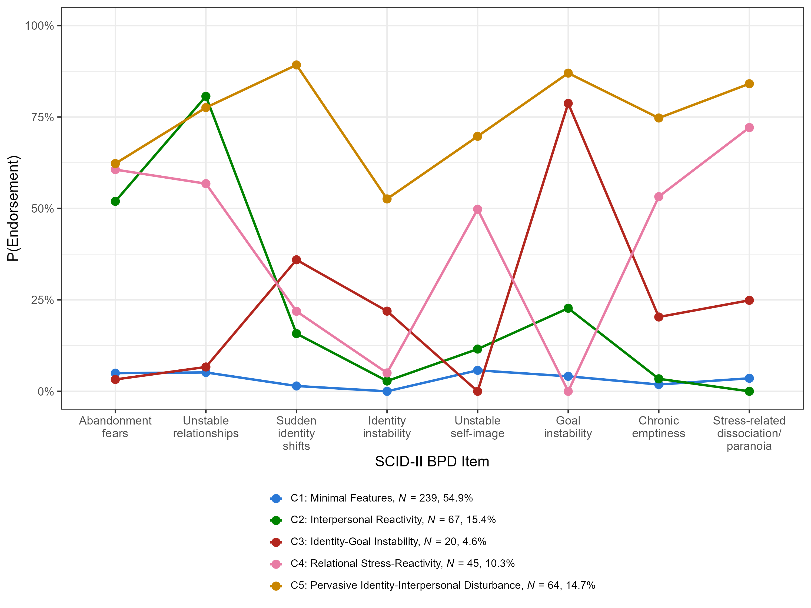
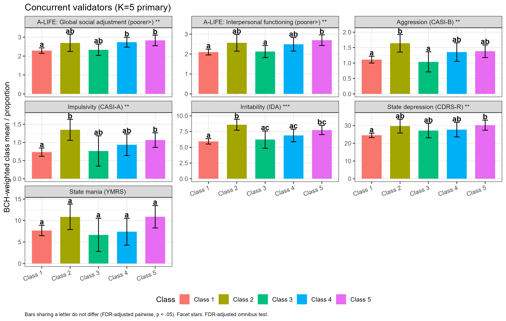
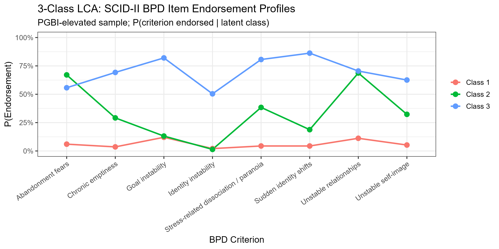
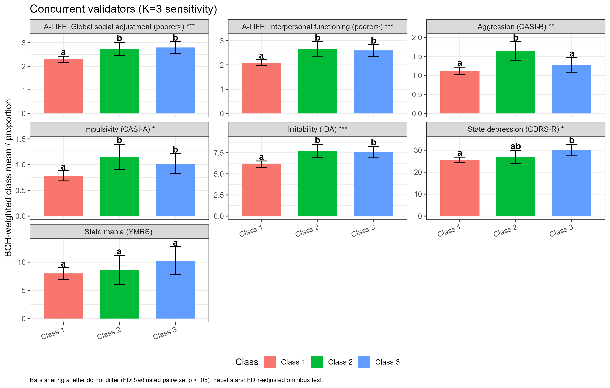
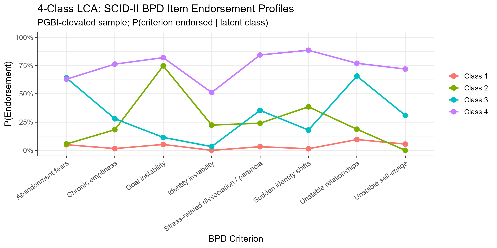
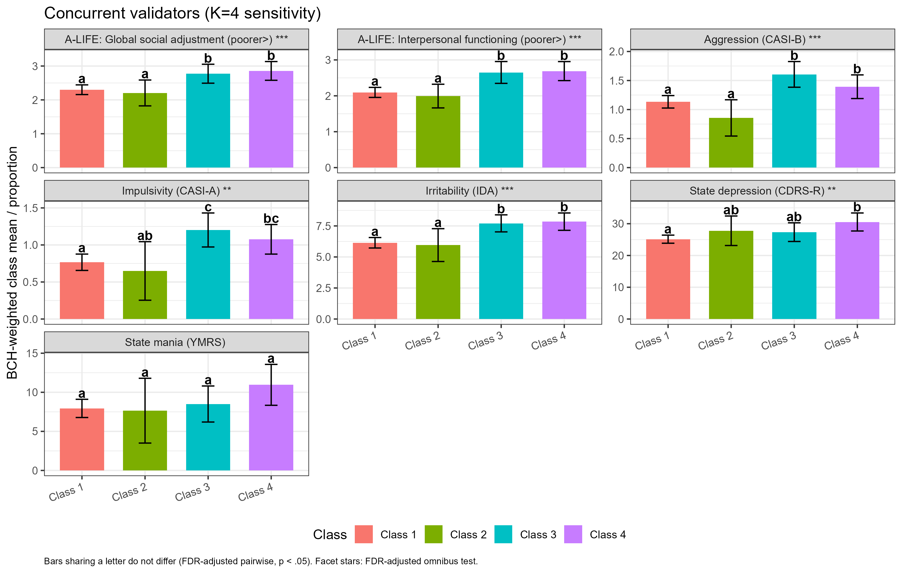

# Omnibus Wald Test Figures

Visual companion to the omnibus and pairwise tables in `complete_results.md`
— the same seven concurrent validators (aggression, impulsivity,
irritability, state mania, state depression, and the two A-LIFE
psychosocial-functioning items), for each of the *K*=5 primary and *K*=3/*K*=4
sensitivity solutions. Images are also found in the figures folder.

For each *K*, two figures:
- **Item-endorsement profile** — the 8 SCID-II items' endorsement
  probability by class, the basis for each class's interpretation and for
  the typology-vs-continuum check described in `detailed_methods.md`.
- **Validator comparison (bar + compact-letter display)** — BCH-corrected
  class means/proportions per validator, with 95% CIs, FDR-adjusted
  omnibus significance stars in each facet strip, and compact letters
  under each bar (bars sharing a letter do not differ after FDR
  correction). This is the figure form of `complete_results.md` §2.3–2.4,
  §3.3–3.4, §4.3–4.4.

---

## *K* = 5 (primary)

---

## *K* = 3 (sensitivity)

---

## *K* = 4 (sensitivity)

